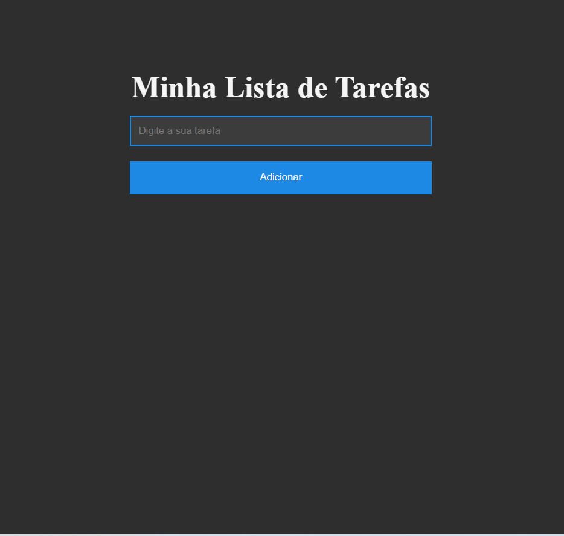

# todo-list-javascript

O projeto está publicado na Vercel: Ver projeto online [Ver projeto online](https://todo-list-javascript-rho-seven.vercel.app/)(Abre em uma nova aba)

Aplicação web desenvolvida com HTML, CSS e JavaScript(ES6+) para gerenciar tarefas. Permite adicionar e remover tarefas. O design é mobile first e responsivo, com melhorias visuais para uma melhor experiência do usuário.

## Instalação

    git clone https://github.com/seuusuario/todo-list-javascript.git

## Acesse a pasta do Projeto

        cd todo-list-javascript

## Execute a aplicação

- Abra o arquivo index.html em um navegador moderno (Chrome, Firefox, Edge etc) 

## Tecnologias

1. **`HTML5`**
2. **`CSS3`**
3. **`JavaScript(ES6+)`**
4. **`Font Awesome`**

## Documentação
[Font Awesome](https://cdnjs.com/libraries/font-awesome)

## Etapas do Desenvolvimento

- Criar a estrutura HTML.

- Instalar a Font Awesome no HTML

- Criar a  estilização com CSS.

- Criar o Arquivo de JavaScript

- Seleção de Elementos da Dom
- Funções
- Eventos

<!-- - Criar funções JavaScript para manipulação do DOM.

- Adicionar evento de clique no botão para adicionar tarefas (addEventListener).

- Pegar o valor do input, validar com trim() e criar elementos li dinamicamente.

- Criar span com “❌” para deletar tarefas, com evento de clique para remover o li.

- Limpar o input após adicionar uma tarefa. -->

## Funcionalidades

<!-- 1. Criar a Função de Adicionar Tarefa
2. Pegar o valor do Input
3. Criar a tag Li do HTML
4. Colocar o valor do Input dentro da Li + o Span com o X
5. Pegar Ul + a Lista e injeta dentro dela a Li
6. Zerar o Input
7. Criar a Função de Deletar a Tarefa
8. Pegar a Li que quero deletar -->

## Responsividade

- Layout adaptado para dispositivos móveis.

- Ajustes de estilo aplicados via media queries para telas maiores que aumente o tamanho do texto

## Licença

- Este projeto está sob a licença MIT.

