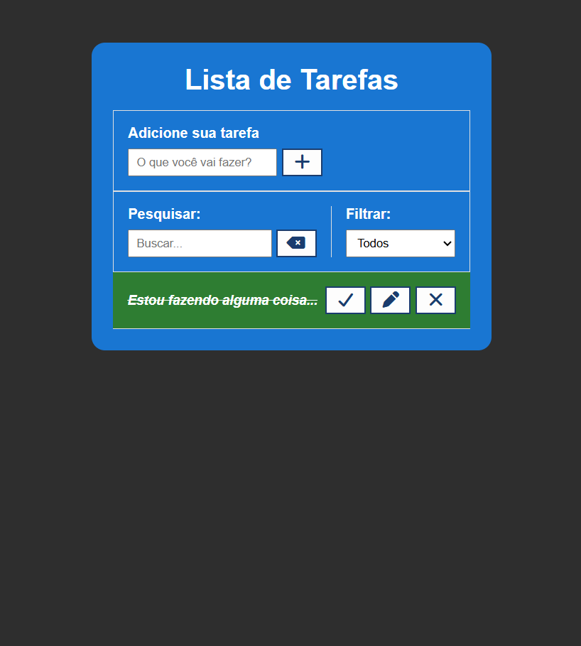

# todo-list-javascript

O projeto está publicado na Vercel: Ver projeto online [Ver projeto online]()(Abre em uma nova aba)

Aplicação web desenvolvida com HTML, CSS e JavaScript(ES6+) para gerenciar tarefas. Permite adicionar e remover tarefas. O design é mobile first e responsivo, com melhorias visuais para uma melhor experiência do usuário.

## Instalação

    git clone https://github.com/seuusuario/todo-list-javascript.git

## Acesse a pasta do Projeto

        cd todo-list-javascript

## Execute a aplicação

- Abra o arquivo index.html em um navegador moderno (Chrome, Firefox, Edge etc) 

## Tecnologias

1. **`HTML5`**
2. **`CSS3`**
3. **`JavaScript(ES6+)`**
4. **`Font Awesome`**

## Documentação
[Font Awesome](https://cdnjs.com/libraries/font-awesome)

## Etapas do Desenvolvimento

- Criar a estrutura HTML.

- Instalar a Font Awesome no HTML

- Criar a  estilização com CSS.

- Criar o Arquivo de JavaScript

- Seleção de Elementos da Dom
- Funções
- Eventos

## Funcionalidades

1. Selecionar todo o Formulário
2. Input de Adicionar Tarefa
3. Mapear as listas
4. Mapear o edit form
5. Mapear o campo de edição
6. Mapear o campo de cancelar a edição
7. Criar o evento de enviar o formulário
8. Pegar o valor do input digitado
9. Criar uma validação
10. Criar uma função de salvar a tarefa
11. Criar de limpar o input
12. Criar o evento do clique dos botões 
13. Esconder o Fomulário
14. Criar o de Pesquisar e Filtrar
15. Inserido os medias queries 

## Responsividade

- Layout adaptado para dispositivos móveis.

- Ajustes de estilo aplicados via media queries para telas maiores que aumente o tamanho do texto

## Licença

- Este projeto está sob a licença MIT.

